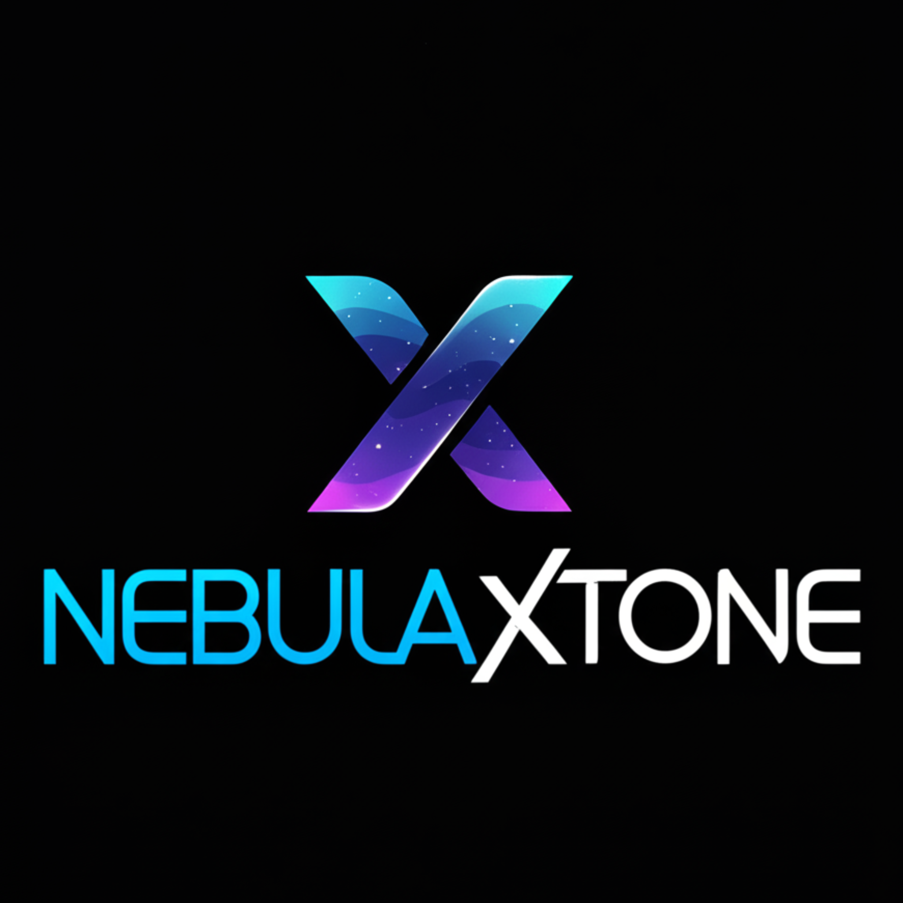

# 🎶 NebulaXTune

  

**NebulaXTune** é um aplicativo inteligente projetado para identificar instrumentais, analisar faixas musicais e oferecer ferramentas avançadas para músicos, produtores e entusiastas da música.

Com ele, você pode:

- 🎧 Identificar instrumentos presentes em qualquer faixa de áudio
- 🎼 Analisar estrutura, tom, notas e características musicais
- 🔍 Obter insights detalhados sobre a composição de músicas
- 🛠️ Usar recursos extras para manipulação, separação e ajuste de trilhas

Seja você um profissional da música ou apenas um apaixonado por som, o NebulaXTune foi feito para transformar a forma como você interage com a música.

## 🌟 Inspiração

A ideia do NebulaXTune nasceu da experiência pessoal de ouvir músicas produzidas por artistas independentes. Muitas vezes, ao apreciar essas criações, surgia a dificuldade de reconhecer tons e identificar as notas tocadas com precisão — especialmente para quem não tem um ouvido musical treinado.

Mesmo utilizando ferramentas de geração musical, a compreensão da estrutura musical e dos elementos sonoros ainda não era tão clara. Foi aí que surgiu o propósito do projeto: criar uma ferramenta acessível, que permita **entender o tom da música, identificar instrumentos e separar facilmente vocais de instrumentais**.

O NebulaXTune nasce como uma ponte entre a tecnologia e a criatividade musical, ajudando qualquer pessoa — com ou sem formação técnica — a explorar, aprender e criar com mais confiança.

Além disso, o projeto é **open source**, incentivando a colaboração da comunidade e permitindo que qualquer pessoa contribua, estude ou adapte o aplicativo para seus próprios usos criativos.

## 🛠️ Notas

Este projeto ainda está em fase **inicial de desenvolvimento**. Estamos estruturando ideias, explorando tecnologias e definindo as funcionalidades principais do NebulaXTune.

Nosso objetivo é construir uma ferramenta útil, acessível e colaborativa para quem ama música e tecnologia.

🔔 Em breve traremos **novidades**, atualizações e uma versão utilizável da aplicação.  
Fique à vontade para acompanhar, dar sugestões ou contribuir com o projeto!
